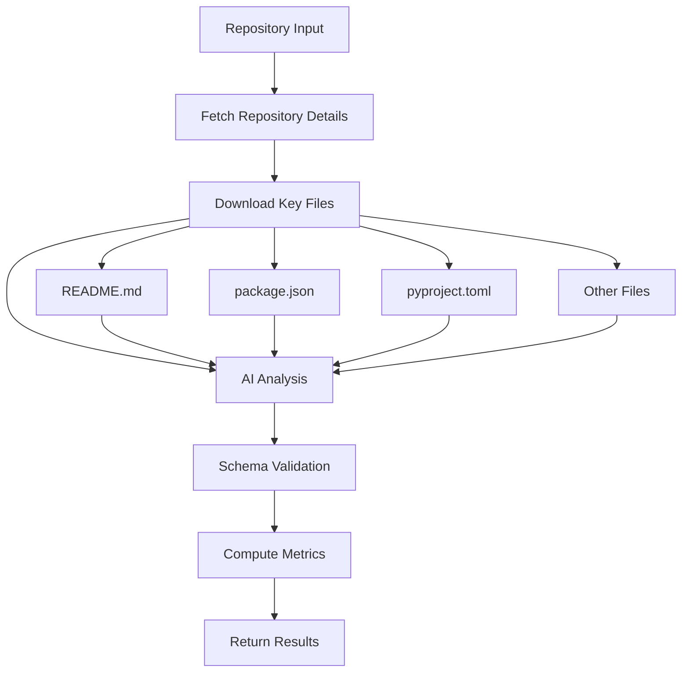
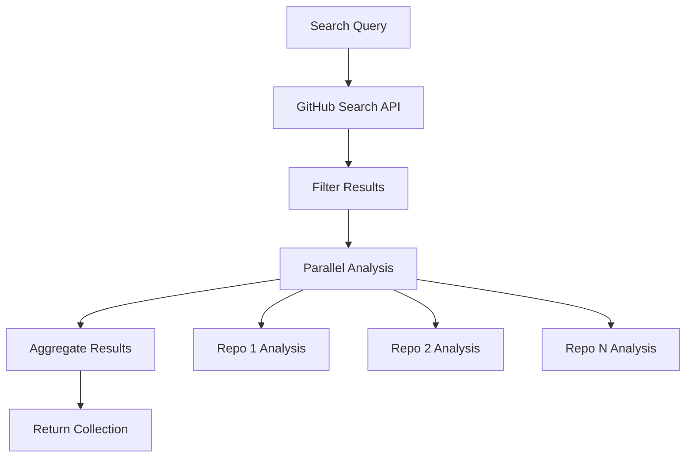
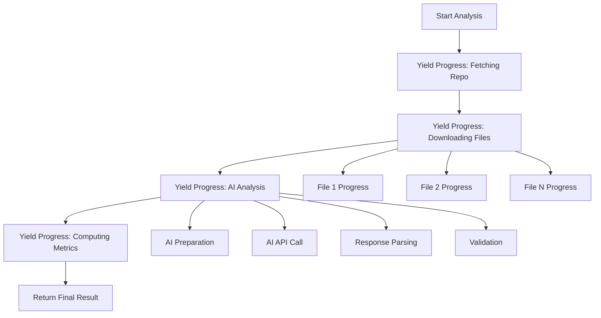

# Architecture Guide

This document provides a comprehensive overview of the MCP GitHub Parser architecture, design decisions, and implementation details.

## Table of Contents

- [Overview](#overview)
- [Core Components](#core-components)
- [Data Flow](#data-flow)
- [AI Provider Chain](#ai-provider-chain)
- [Progress Reporting System](#progress-reporting-system)
- [Schema System](#schema-system)
- [Design Decisions](#design-decisions)
- [Performance Considerations](#performance-considerations)

## Overview

The MCP GitHub Parser is designed as a modular, extensible system for analyzing GitHub repositories and extracting MCP-related information. The architecture follows several key principles:

- **Separation of Concerns**: Each component has a single, well-defined responsibility
- **Extensibility**: Easy to add new AI providers, parsers, and analysis types
- **Robustness**: Comprehensive error handling and fallback mechanisms
- **Performance**: Efficient API usage and caching strategies
- **Type Safety**: Full TypeScript support with comprehensive type definitions

## Core Components

### 1. GitHubClient (`src/github-client.ts`)

The main orchestrator that coordinates all analysis operations.

**Responsibilities:**
- GitHub API interactions (search, file downloads)
- Repository analysis workflow coordination
- Progress reporting management
- AI provider integration
- Result aggregation and validation

**Key Methods:**
- `search()`: Repository discovery
- `getFullRepositoryData()`: Complete analysis workflow
- `getFullRepositoryDataWithProgress()`: Analysis with progress reporting
- `downloadKeyFiles()`: Strategic file downloading

### 2. AI Provider System (`src/parsers/`)

A flexible, multi-provider AI system with automatic fallback.

**Components:**
- `AIProvider`: Unified interface with fallback chain
- `GeminiJSONParser`: Google Gemini integration
- `OpenRouterJSONParser`: OpenRouter API integration  
- `TogetherJSONParser`: Together.ai integration
- `GeminiSchemaSanitizer`: Schema compatibility layer

**Fallback Chain:**
```
Gemini → OpenRouter → Together.ai
```

### 3. Schema System (`src/schemas/`)

Comprehensive type definitions and validation schemas.

**Components:**
- `github-repo-schema.ts`: Repository and installation method schemas
- TypeScript interfaces for type safety
- JSON schemas for AI response validation
- Schema sanitization for provider compatibility

### 4. Progress System (`src/types/progress.ts`)

AsyncGenerator-based progress reporting for long-running operations.

**Progress Types:**
- `RepoAnalysisProgress`: Repository fetching
- `FileDownloadProgress`: File downloading
- `AIParsingProgress`: AI analysis
- `SearchProgress`: Multi-repository search

### 5. Prompt Engineering (`src/prompts/`)

Specialized prompts for MCP repository analysis.

**Components:**
- `mcp-analysis-prompt.ts`: Comprehensive analysis prompts
- MCP classification guidelines
- Installation method extraction prompts
- Response schema generation

## Data Flow

### Single Repository Analysis



### Multi-Repository Search and Analysis



### Progress Reporting Flow



## AI Provider Chain

### Provider Selection Strategy

The system uses a sophisticated fallback chain to ensure maximum reliability:

1. **Gemini (Primary)**: Fast, accurate, with schema sanitization
2. **OpenRouter (Secondary)**: Reliable fallback with multiple models
3. **Together.ai (Tertiary)**: Final fallback option

### Schema Compatibility

Different AI providers have varying schema support requirements:

**Gemini Requirements:**
- No `additionalProperties: false`
- Simplified enum definitions
- Specific property structures

**OpenRouter/Together.ai:**
- Standard JSON Schema support
- Full enum and validation support

### Error Handling Strategy

```typescript
async parseWithSchema(prompt: string, schema: any): Promise<any> {
  const errors: string[] = [];
  
  // Try each provider in sequence
  for (const provider of [gemini, openrouter, together]) {
    try {
      return await provider.parse(prompt, schema);
    } catch (error) {
      errors.push(`${provider.name}: ${error.message}`);
      continue; // Try next provider
    }
  }
  
  throw new Error(`All providers failed: ${errors.join('; ')}`);
}
```

## Progress Reporting System

### AsyncGenerator Pattern

The progress system uses AsyncGenerators for streaming progress updates:

```typescript
async *getFullRepositoryDataWithProgress(repo: string): AsyncGenerator<ProgressUpdate, GitHubRepoWithInstallation> {
  // Yield progress updates
  yield { step: 'fetching_repo', progress: 10, message: 'Fetching repository...' };
  
  // Perform work
  const repoData = await this.fetchRepository(repo);
  
  // Yield more progress
  yield { step: 'downloading_files', progress: 30, message: 'Downloading files...' };
  
  // Continue until complete
  return finalResult;
}
```

### Progress Phases

1. **Repository Fetching (0-25%)**
   - GitHub API calls
   - Repository metadata extraction

2. **File Downloading (25-50%)**
   - Strategic file selection
   - Parallel downloads
   - Content extraction

3. **AI Analysis (50-80%)**
   - Prompt preparation
   - AI provider calls
   - Response parsing and validation

4. **Metrics Computation (80-100%)**
   - Final data processing
   - Result aggregation
   - Quality validation

## Schema System

### Type Safety Strategy

The system maintains type safety through multiple layers:

1. **TypeScript Interfaces**: Compile-time type checking
2. **JSON Schemas**: Runtime validation
3. **Zod Schemas**: Additional validation layer (future enhancement)

### Schema Evolution

Schemas are designed for backward compatibility:

```typescript
interface InstallationMethodV1 {
  type: string;
  title: string;
  description: string;
}

interface InstallationMethodV2 extends InstallationMethodV1 {
  category: string;
  platform?: string;
  // New fields are optional for backward compatibility
}
```

## Design Decisions

### 1. AsyncGenerator for Progress

**Decision**: Use AsyncGenerators for progress reporting
**Rationale**: 
- Streaming progress updates
- Memory efficient
- Natural async/await integration
- Cancellation support

### 2. Multi-Provider AI Chain

**Decision**: Implement fallback chain across multiple AI providers
**Rationale**:
- Reliability through redundancy
- Cost optimization
- Performance optimization
- Provider-specific strengths

### 3. Strategic File Downloading

**Decision**: Download only key files rather than entire repositories
**Rationale**:
- Reduced API calls and bandwidth
- Faster analysis
- Focus on installation-relevant content
- GitHub API rate limit optimization

### 4. Comprehensive Schema System

**Decision**: Maintain both TypeScript interfaces and JSON schemas
**Rationale**:
- Compile-time type safety
- Runtime validation
- AI provider compatibility
- Documentation generation

### 5. Modular Parser Architecture

**Decision**: Separate parsers for different AI providers
**Rationale**:
- Provider-specific optimizations
- Easy addition of new providers
- Isolated error handling
- Independent testing

## Performance Considerations

### GitHub API Optimization

- **Rate Limiting**: Respect GitHub API limits (5000/hour authenticated)
- **Caching**: Cache repository metadata and file contents
- **Batch Operations**: Group API calls where possible
- **Strategic Downloads**: Only download essential files

### AI Provider Optimization

- **Provider Selection**: Choose fastest available provider
- **Prompt Optimization**: Minimize token usage
- **Response Caching**: Cache AI responses for identical inputs
- **Timeout Management**: Prevent hanging requests

### Memory Management

- **Streaming Processing**: Process large datasets incrementally
- **Garbage Collection**: Explicit cleanup of large objects
- **File Size Limits**: Limit downloaded file sizes
- **Progress Cleanup**: Clean up progress tracking resources

### Concurrency

- **Parallel File Downloads**: Download multiple files simultaneously
- **Repository Analysis**: Analyze multiple repositories in parallel
- **AI Request Queuing**: Manage concurrent AI provider requests

## Extension Points

### Adding New AI Providers

1. Implement the `AIProvider` interface
2. Add to the fallback chain in `ai-provider.ts`
3. Add provider-specific configuration
4. Update documentation

### Adding New Analysis Types

1. Define new schema types
2. Create specialized prompts
3. Extend the `computed` fields
4. Update progress reporting

### Adding New File Types

1. Add to `filesToTry` array in `downloadKeyFiles()`
2. Update parsing logic if needed
3. Add file-specific analysis rules

### Custom Progress Reporting

1. Extend progress types
2. Implement custom progress generators
3. Add progress transformation logic
4. Update UI integration points

This architecture provides a solid foundation for analyzing GitHub repositories while remaining flexible and extensible for future enhancements.
