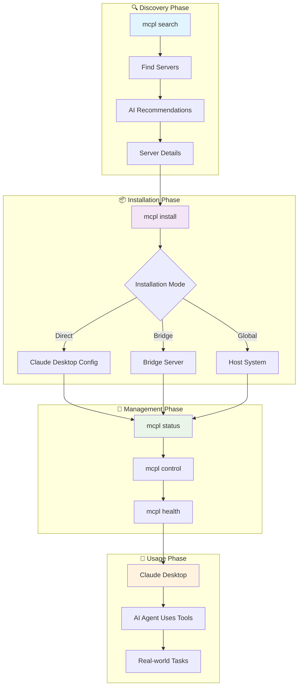
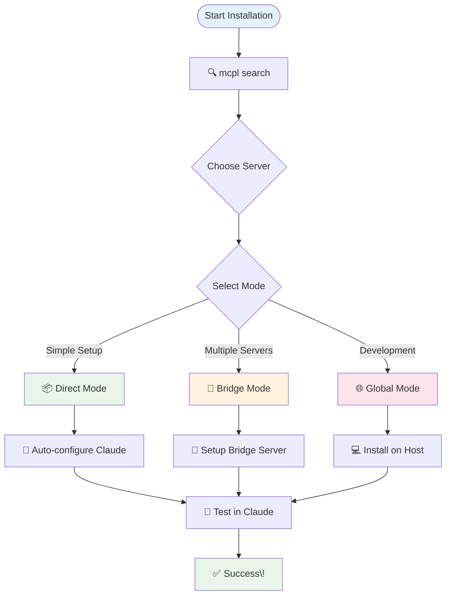
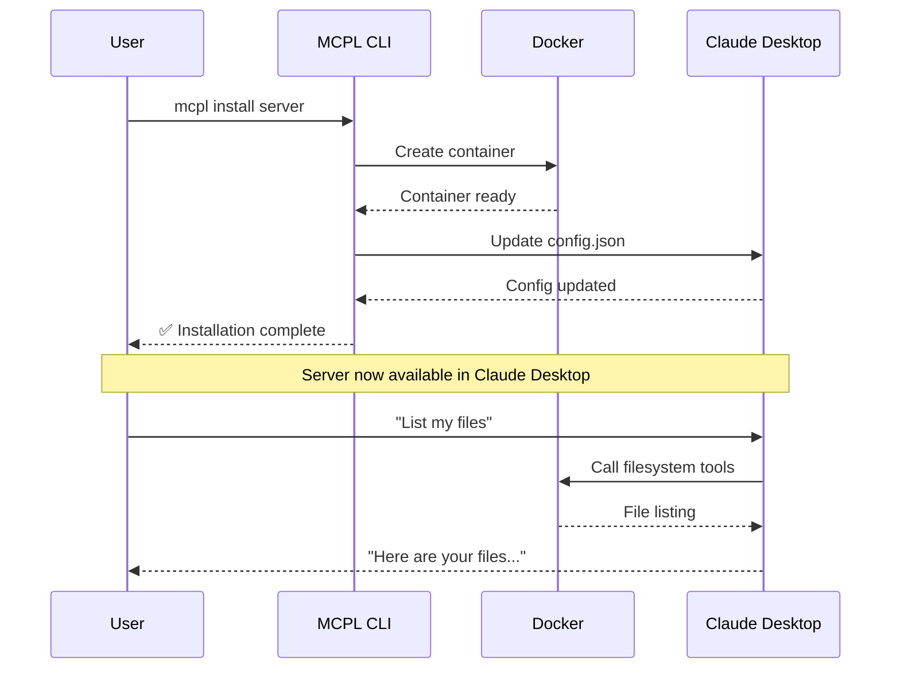
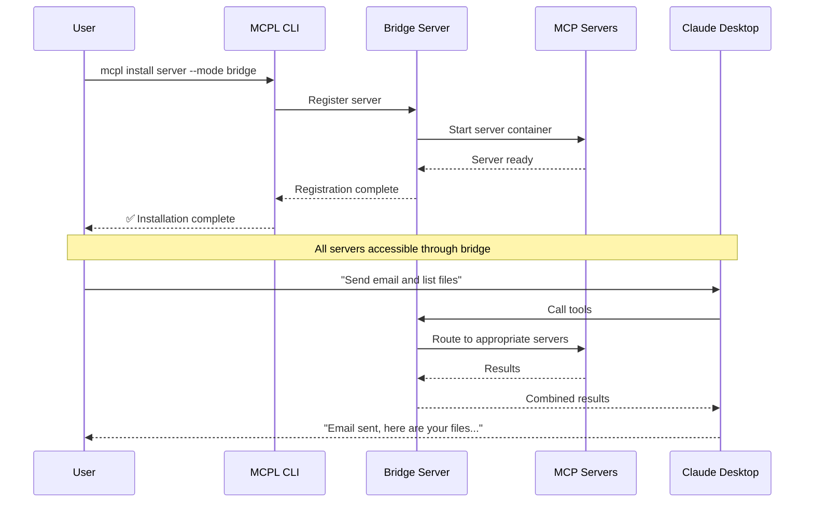
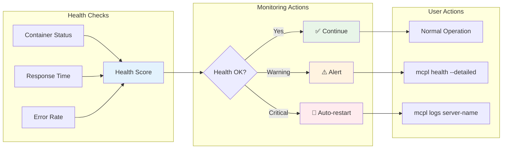
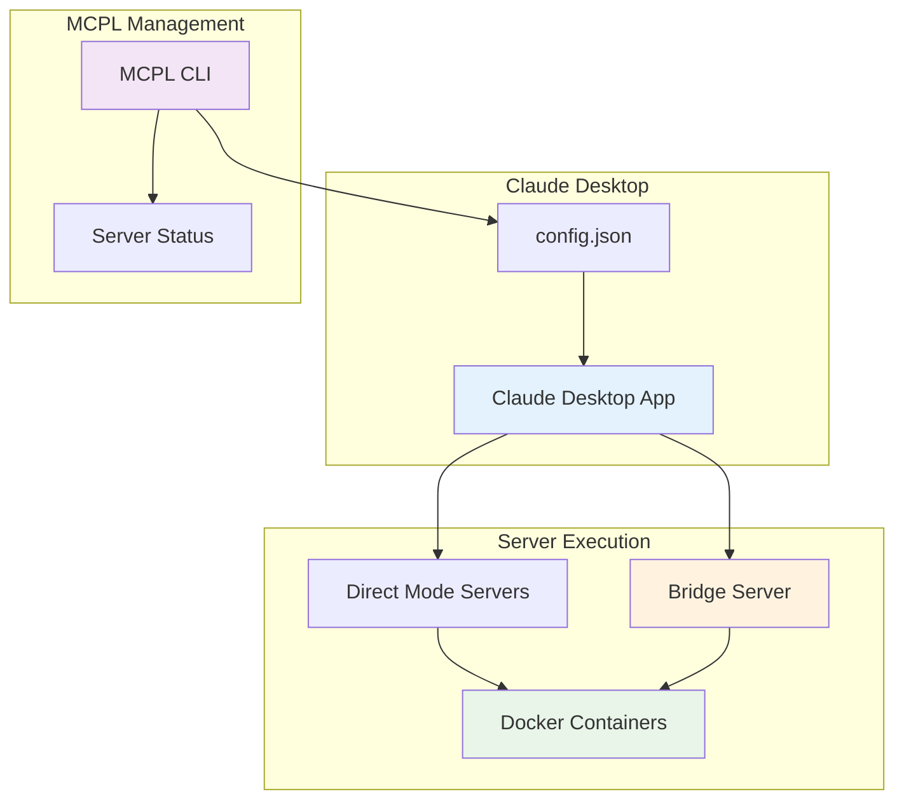
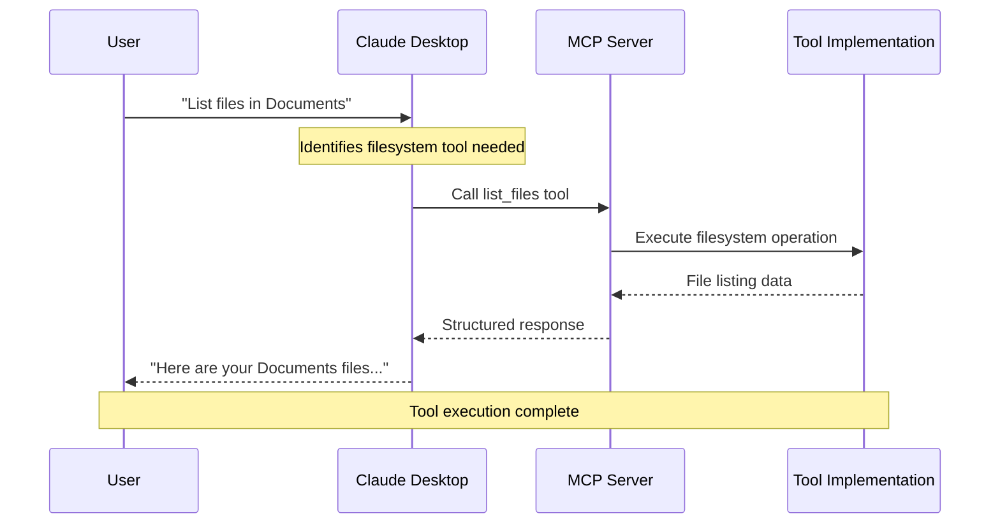
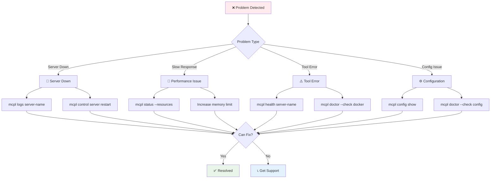
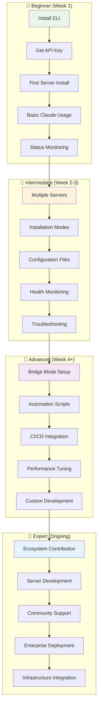

# 🎨 Visual Workflow Guide

**Interactive Visual Guide to MCPL CLI and MCP Servers**

## 🎯 **The Complete MCPL Ecosystem**



## 🔄 **Installation Mode Comparison**

### **📊 Mode Comparison Chart**

| Feature | Direct Mode | Bridge Mode | Global Mode |
|---------|-------------|-------------|-------------|
| **Setup Complexity** | 🟢 Simple | 🟡 Medium | 🟢 Simple |
| **Security** | 🟢 High (Docker) | 🟢 High (Docker) | 🔴 Low (Host) |
| **Performance** | 🟢 Fast | 🟡 Medium | 🟢 Fast |
| **Tool Management** | 🟡 Static | 🟢 Dynamic | 🟡 Static |
| **Multi-Server** | 🔴 Complex | 🟢 Easy | 🔴 Complex |
| **Monitoring** | 🟡 Basic | 🟢 Advanced | 🟡 Basic |
| **Best For** | Single servers | Multiple servers | Development |

### **🎯 Visual Installation Flow**



## 🔍 **Discovery Workflow Visualization**

### **Search Strategy Decision Tree**

```mermaid
flowchart TD
    Need[I need MCP tools] --> Know{Do I know what I need?}
    
    Know -->|Yes| Specific[🎯 Specific Search]
    Know -->|No| Explore[🔍 Explore Options]
    Know -->|Maybe| Smart[🧠 AI-Powered Search]
    
    Specific --> Technical[mcpl search --capability email]
    Specific --> Domain[mcpl search --domain gmail.com]
    
    Explore --> Browse[mcpl list available]
    Explore --> Category[mcpl list available --category productivity]
    
    Smart --> Natural[mcpl search "I need email automation" --smart]
    Smart --> Intent[mcpl search "customer support tools" --smart]
    
    Technical --> Results[📋 Review Results]
    Domain --> Results
    Browse --> Results
    Category --> Results
    Natural --> Results
    Intent --> Results
    
    Results --> Install[📦 mcpl install]
    
    style Need fill:#e3f2fd
    style Smart fill:#fff3e0
    style Results fill:#e8f5e8
    style Install fill:#f3e5f5
```

## 📦 **Installation Modes Deep Dive**

### **🎯 Direct Mode Workflow**



### **🌉 Bridge Mode Workflow**



## 🔧 **Management Dashboard Visualization**

### **📊 Server Status Dashboard**

```
┌─────────────────────────────────────────────────────────────┐
│                    MCPL Server Dashboard                   │
├─────────────────────────────────────────────────────────────┤
│ Server Name          │ Status  │ Mode   │ Health │ Uptime  │
├─────────────────────────────────────────────────────────────┤
│ filesystem-server    │ 🟢 UP   │ Direct │ 98%    │ 2d 4h   │
│ email-server         │ 🟢 UP   │ Bridge │ 95%    │ 1d 12h  │
│ calendar-server      │ 🟡 WARN │ Bridge │ 87%    │ 3h 22m  │
│ crm-server          │ 🔴 DOWN │ Bridge │ 0%     │ 0m      │
├─────────────────────────────────────────────────────────────┤
│ Total Servers: 4     │ Active: 3      │ Failed: 1        │
│ Memory Usage: 2.1GB  │ CPU: 45%       │ Containers: 4    │
└─────────────────────────────────────────────────────────────┘

Commands:
  mcpl status --watch     # Live monitoring
  mcpl health --detailed  # Detailed health info
  mcpl control crm-server restart  # Fix failed server
```

### **🔍 Health Monitoring Flow**



## 🚀 **Claude Desktop Integration**

### **🔗 Integration Architecture**



### **🎯 Tool Usage Flow**



## 📊 **Performance Monitoring**

### **📈 Performance Metrics Dashboard**

```
┌─────────────────────────────────────────────────────────────┐
│                  Performance Metrics                       │
├─────────────────────────────────────────────────────────────┤
│                                                             │
│ Response Time (ms)     Memory Usage (MB)    CPU Usage (%)   │
│                                                             │
│ filesystem: ████ 45ms  filesystem: ███ 128  filesystem: ██ 12% │
│ email:      ██ 120ms   email:      ████ 256 email:      ███ 25% │
│ calendar:   ███ 89ms   calendar:   ██ 64    calendar:   █ 8%   │
│                                                             │
├─────────────────────────────────────────────────────────────┤
│ Alerts:                                                     │
│ ⚠️  email-server: High memory usage (256MB > 200MB limit)   │
│ ✅ All other servers operating normally                     │
└─────────────────────────────────────────────────────────────┘

Real-time monitoring: mcpl status --watch --dashboard
```

### **🔍 Troubleshooting Decision Tree**



## 🎓 **Learning Path Visualization**

### **📚 Skill Progression Map**



## 🎯 **Quick Reference Cards**

### **🔍 Discovery Commands**
```bash
# Natural Language Search
mcpl search "email automation tools"
mcpl search "I need customer support tools" --smart

# Technical Search  
mcpl search --capability email --verified-only
mcpl search --domain gmail.com --transport http

# Browse Available
mcpl list available --category productivity
mcpl list available --verified-only --limit 20
```

### **📦 Installation Commands**
```bash
# Direct Mode (Default)
mcpl install @modelcontextprotocol/server-filesystem

# Bridge Mode
mcpl install @company/server --mode bridge --auto-start

# Global Mode
mcpl install @company/dev-server --global

# With Configuration
mcpl install @company/server \
  --memory-limit 1g \
  --env API_KEY=secret \
  --auto-start
```

### **🔧 Management Commands**
```bash
# Status and Health
mcpl status                    # List all servers
mcpl status --watch           # Live monitoring
mcpl health server-name       # Health check
mcpl health --watch           # Live health monitoring

# Control
mcpl control server start     # Start server
mcpl control server restart   # Restart server
mcpl control --all restart    # Restart all servers

# Diagnostics
mcpl doctor                   # System check
mcpl logs server-name         # View logs
mcpl logs server --follow     # Follow logs
```

### **⚙️ Configuration Commands**
```bash
# Configuration Management
mcpl config show              # Show current config
mcpl config set key value     # Set configuration
mcpl config get key           # Get configuration value

# Authentication
mcpl login --key your-api-key # Set API key
mcpl login --status           # Check login status
mcpl logout                   # Remove API key
```

---

**🎨 This visual guide provides an interactive way to understand the MCPL ecosystem. Use the flowcharts and diagrams to navigate your learning journey\!** 🚀
